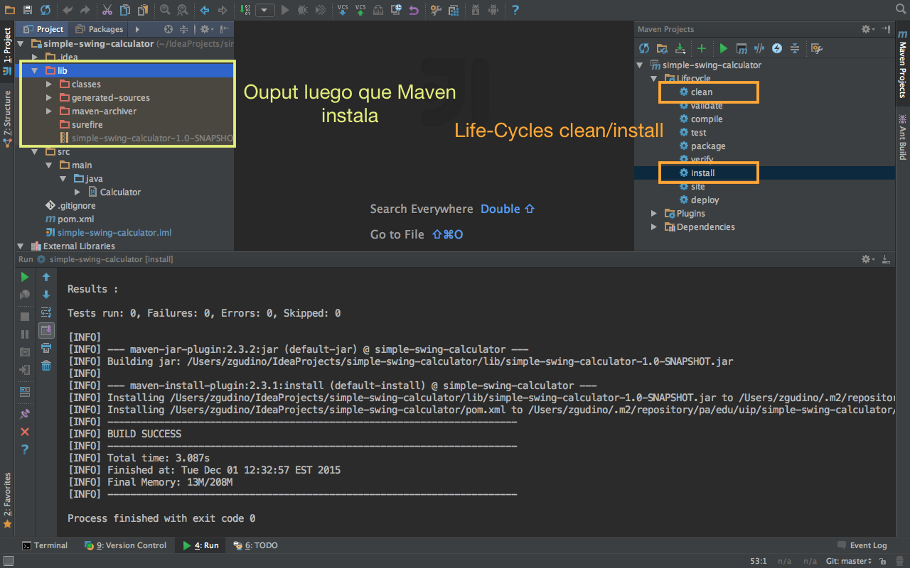

# simple-swing-calculator
> Calculadora en Swing que no hace más que sumar enteros

### Requisitos
- JDK 1.8
- Maven 3.0+

### Instalación
Clone este repositorio en su estación de trabajo.
```bash
git clone https://github.com/zgudino/simple-swing-calculator.git
```
Luego, desde la línea de comando ejecutar lo siguiente.
```bash
mvn clean install
```

Varios IDE incluyen Maven por defecto. Ejemplo, IntelliJ Idea solo basta con ejecutar clean/install dentro del Life-Cycles



Listo ya puede ejecutar `Calculator.java`.


